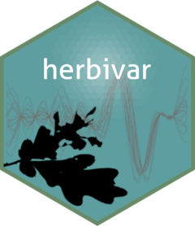

# *herbivar*


### Quantitative Tools for Variance Explicit Ecology and Herbivory


## Overview 

This package makes several methods used for analyzing variability inecological data available. Currently, it supports fitting a neutral herbivory model to data using Maximum Likelihood Estimation (MLE). It also contains several helper functions for comparing distributions and assessing model fit. In addition, using the *imager* infrastructure, the package also supports automatic processing of leaf images, mostly in the context of leaf scans, that can retrieve rich within-leaf herbivory data. The package is integrated with the *spatstat* packages that allows for spatial analysis of these data. 
    
Currently work in progress, mostly for internal use only. Proceed with caution :)

Report any bugs to vsbpan@gmail.com Thanks!

## Installation

To use the *herbivar* package, you'll need to first use the `install_github()` function from the *devtools* package to install the latest version of *herbivar* from github. You can just run the code chunk below on your machine to install the packages. The *herbivar* package depends on *EBImage*, which can be installed via `BiocManager::install()`. If you not using Windows, you might have a problem with the file `libX11.6.dylib`, which the dependent package *imager* uses. You'll need to install XQuartz (https://www.xquartz.org/) to fix the error. You can set `build_vignettes = TRUE` in `install_github()` if you want to have the vignette. 

```{r}
  #install.packages("devtools")
  #install.packages("BiocManager") 
  #BiocManager::install("EBImage")
  devtools::install_github("vsbpan/herbivar", build_vignettes = FALSE, dependencies = TRUE, force = TRUE)
```
## Vignette

You can access the vignette via the command below. Alternatively, you can find the knitted HTML file in the **vignettes** folder by first downloading the ZIP file of the repository. 

```{r}
browseVignettes("herbivar")
```


